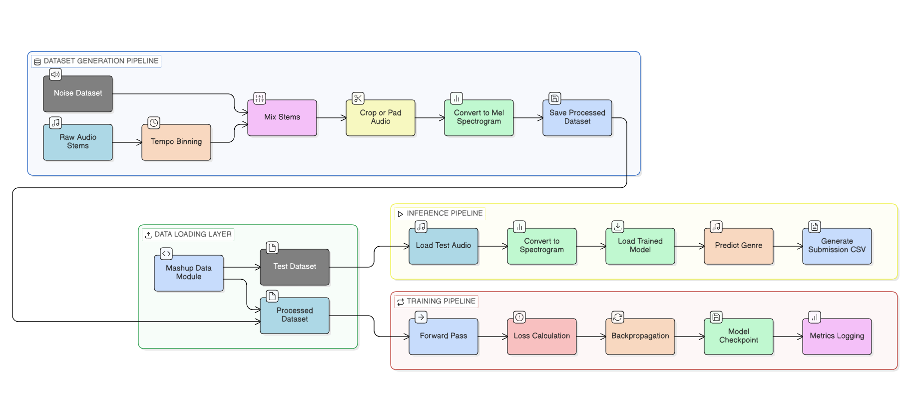
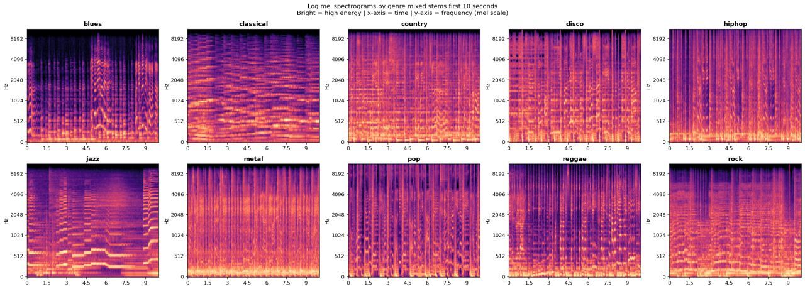
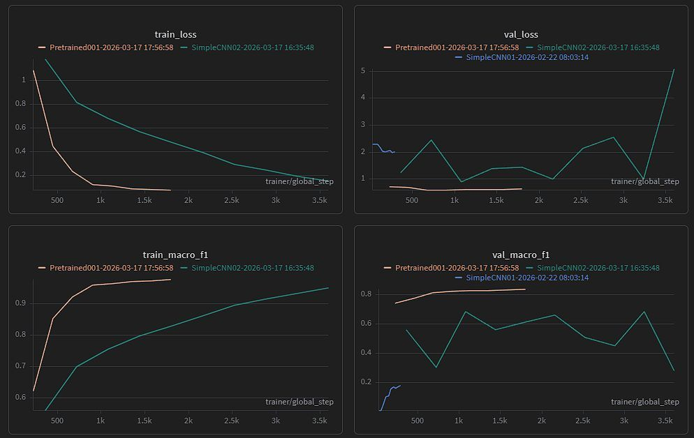

# Messy Mashup – Robust Music Genre Classification  

End-to-end deep learning system for robust music genre classification from noisy mixed audio mashups.

Built with **PyTorch Lightning, Torchaudio, Weights & Biases, and KaggleHub**.

> Designed as an end-to-end audio machine learning system covering data generation, preprocessing, model training, experiment tracking, and inference.

---

## Overview

Music genre classification becomes significantly harder when audio is noisy, mixed, and distribution-shifted.

This project tackles the **Messy Mashup** challenge: predicting music genres from noisy mashup audio samples created by combining instrument stems from multiple songs, synchronizing tempo, and injecting environmental noise.

Unlike standard audio classification tasks that use clean tracks, this project focuses on **robust generalization under real-world audio distortions**.

### Objectives
- Classify mashup audio into 10 music genres
- Build models robust to tempo changes, noise, and stem recombination
- Design a modular experimentation framework for rapid iteration
- Compare multiple deep learning architectures

---


## Key Highlights

- Built a modular end-to-end deep learning pipeline for audio classification
- Developed synthetic dataset generation by mixing stems and adding noise
- Converted raw waveforms into Mel Spectrogram representations
- Implemented reusable training workflows with PyTorch Lightning
- Experimented with multiple architectures:
  - CNN from scratch
  - Improved CNN over spectrograms
  - Experimented with multiple deep learning architectures
- Integrated Weights & Biases for experiment tracking
- Built Kaggle-ready inference pipeline
- Structured codebase for reproducibility and scalability

---


## End-to-End System Pipeline


---

## Mel Spectrogram Visualization


---

## Results

### Internal Validation
- Macro F1 Score: **0.84**

### Kaggle Competition
- Private Leaderboard Score: **0.40286**
> The large gap reflects the challenge of distribution shift between synthetic validation data and noisy competition mashups, highlighting the importance of robust generalization.
---

## Dataset
The dataset contains:
- clean instrument stems for supervised training
- ESC-50 environmental noise samples for augmentation
- noisy mashup audio files for evaluation

```dataset/
messy_mashup
├── ESC-50-master
├── genres_stems
├── mashups
├── sample_submission.csv
└── test.csv
```

Genres include: `classical`, `country`, `disco`, `hiphop`, `jazz`, `metal`, `pop`, `reggae`, `rock`, and `blues`.

---

## Experiment Tracking
All experiments tracked using **Weights & Biases**.
[W&B Dashboard](https://wandb.ai/24f1001707-dl-genai-project/24f1001707-t12026)



---

## Installation

Clone repository:

```bash
git clone https://github.com/dhruvbansalup/MessyMashup.git
cd MessyMashup
```

Conda environment setup:
```bash
conda env create -f environment.yaml
conda activate messy_mashup
```

Environment Variables: (Add all the required keys and values to the .env file)
```bash
cp .env.example .env
```

---

## Project Structure
```
messy_mashup/
├── README.md
├── data
├── environment.yaml
├── notebooks
├── scripts
│   └── build_audio_dataset.py
├── setup.py
└── src
    ├── __init__.py
    ├── config.py
    ├── data
    │   ├── __init__.py
    │   ├── augmentations.py
    │   ├── datamodule.py
    │   ├── dataset.py
    │   └── transforms.py
    ├── inference.py
    ├── models
    │   ├── __init__.py
    │   ├── base_model.py
    │   ├── pretrained_01.py
    │   ├── simple_cnn_01.py
    │   └── simple_cnn_02.py
    ├── train.py
    └── utils.py
```

---

## Building the Dataset
To build the dataset by mixing the stems and adding noise, run:
```bash
python -m scripts.build_audio_dataset
```

## Training the Model
To train the model, run the following command:
```bash
python -m src.train
```

## Inference
To run inference on the test set and generate predictions for submission, run:
```bash
python -m src.inference
```

---

## Tech Stack
- Python
- PyTorch
- PyTorch Lightning
- Torchaudio
- Librosa
- NumPy
- Weights & Biases
- KaggleHub

---

## Key Learnings

Through this project, I gained practical experience in:

- end-to-end deep learning system design
- audio signal processing
- spectrogram-based learning
- experiment management
- debugging training pipelines
- model evaluation under distribution shift
- modular ML engineering practices

---

## Links
- [W&B Project](https://wandb.ai/24f1001707-dl-genai-project/24f1001707-t12026)
- [Kaggle Competition](https://www.kaggle.com/competitions/jan-2026-dl-gen-ai-project/)
